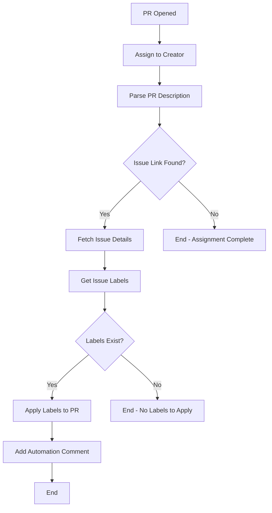

# PR Auto-Label and Assignment Automation

## Overview

This GitHub Actions workflow automatically manages pull requests by:
1. **Assigning PRs to their creators** - When a PR is opened, it's automatically assigned to the person who created it
2. **Applying issue labels to PRs** - Labels from the linked issue are automatically copied to the PR

## How It Works

### Triggering
The workflow runs automatically when:
- A new pull request is opened
- Uses `pull_request_target` event for secure operation

### Process Flow



### What It Does

#### 1. Automatic Assignment
- Assigns the PR to the person who opened it
- Ensures accountability and ownership
- Works even if issue linking fails

#### 2. Label Synchronization
- Extracts issue number from PR description
- Supports multiple linking patterns:
  - `Closes #123`
  - `Fixes #123`
  - `Resolves #123`
  - `Close #123`, `Fix #123`, `Resolve #123`
  - Case-insensitive matching
- Fetches all labels from the linked issue
- Applies those labels to the PR

#### 3. Informative Comments
- Adds a comment to the PR explaining what was done
- Lists which labels were applied
- Confirms the assignment

## Example Usage

### In Your PR Description
```markdown
## Which issue does this PR close?

- Closes #42

## What changes are included in this PR?
...
```

### Result
When you open this PR:
1. ✅ You are automatically assigned as the assignee
2. ✅ All labels from issue #42 are applied to your PR (e.g., `bug`, `good-first-issue`, `documentation`)
3. ✅ A comment is added showing the automation results

## Benefits

### For Contributors
- **Automatic ownership**: No need to manually assign yourself
- **Consistent labeling**: PR labels match the issue automatically
- **Better tracking**: Easy to see who's working on what

### For Maintainers
- **Reduced manual work**: No need to assign and label each PR
- **Consistency**: Labels are always synchronized with issues
- **Better organization**: PRs are properly categorized from the start

### For the Project
- **Improved workflow**: Streamlined PR management
- **Better metrics**: Accurate labeling enables better insights
- **Reduced errors**: Eliminates forgotten assignments or mislabeling

## Workflow Configuration

### Permissions Required
```yaml
permissions:
  issues: write
  pull-requests: write
```

### Event Trigger
```yaml
on:
  pull_request_target:
    types: [opened]
```

**Note**: Uses `pull_request_target` instead of `pull_request` for:
- Access to repository secrets if needed
- Write permissions to the repository
- Secure operation with external contributions

## Supported Issue Link Patterns

The workflow recognizes these patterns in PR descriptions:
- ✅ `Closes #123`
- ✅ `Close #123`
- ✅ `Closed #123`
- ✅ `Fixes #123`
- ✅ `Fix #123`
- ✅ `Fixed #123`
- ✅ `Resolves #123`
- ✅ `Resolve #123`
- ✅ `Resolved #123`

All patterns are **case-insensitive**.

## Error Handling

The workflow gracefully handles various scenarios:

1. **No issue link found**: PR is still assigned to creator
2. **Invalid issue number**: Assignment succeeds, labeling is skipped
3. **Issue has no labels**: Only assignment occurs
4. **Permission errors**: Logs warning but continues

## Logs and Debugging

The workflow provides detailed console logs:
```
🔍 Processing PR #45 created by @username
✅ Assigned PR #45 to @username
📝 PR Body: ...
🔗 Found linked issue #42
🏷️  Issue #42 has labels: bug, good-first-issue
✅ Successfully applied labels to PR #45: bug, good-first-issue
✅ Added automation comment to PR
```

## Customization

### Modifying Label Behavior
If you want to filter or transform labels, edit the script section:
```javascript
const issueLabels = issue.labels
  .map(label => typeof label === 'string' ? label : label.name)
  .filter(label => !label.includes('internal')) // Example: skip internal labels
  .filter(Boolean);
```

### Adjusting Comment Format
Customize the automation comment in the workflow file:
```javascript
const commentBody = [
  '🤖 **Your Custom Message**',
  '',
  `✅ Custom content here`,
  // ...
].join('\n');
```

## Related Workflows

This automation works alongside:
- **pr-create-automate-message.yml** - Welcome message for new PRs
- **auto-unassign-stale-issues.yml** - Manages stale issue assignments
- **issue-create-automate-message.yml** - Welcome message for new issues

## Troubleshooting

### Labels not applying?
- Verify the PR description contains a valid issue link pattern
- Check that the issue exists and has labels
- Ensure the bot has proper permissions

### Assignment not working?
- Verify repository settings allow self-assignment
- Check that the user is a repository contributor

### Manual Override
You can always:
- Manually add or remove labels
- Manually change assignees
- The automation only runs once when the PR opens

## Support

For issues or questions about this automation:
1. Check the [workflow run logs](../../actions/workflows/pr-auto-label-assign.yml)
2. Open an issue with the `automation` label
3. Review related workflows for similar patterns

---

*This automation is part of the Eventra project's efforts to streamline contributions and maintain consistency across issues and pull requests.*
