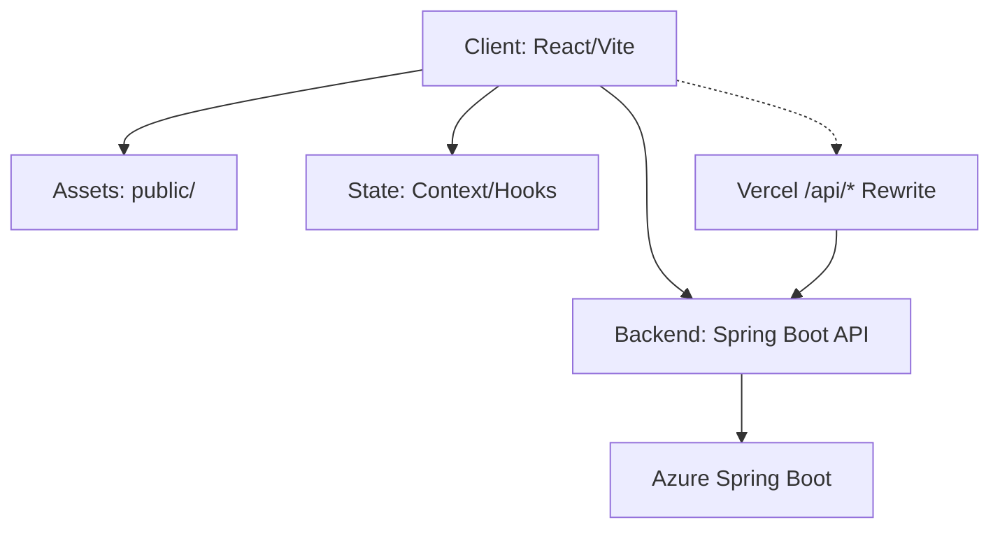

# Eventra

Modern event and hackathon platform for communities, organizers, and contributors.

[](LICENSE)
[](https://react.dev/)
[](https://vitejs.dev/)

---

## Project Status Notice

🚧 Eventra is actively maintained and welcomes contributions from the open-source community. Please check existing issues before creating new ones and follow the contribution guidelines when submitting pull requests.

## Table of Contents

- [Project Status Notice](#project-status-notice)
- [Overview](#overview)
- [Key Features](#key-features)
- [Tech Stack](#tech-stack)
- [Project Architecture](#project-architecture)
- [Project Structure](#project-structure)
- [Prerequisites](#prerequisites)
- [Local Development](#local-development)
- [Docker Development](#docker-development)
- [Environment Variables](#environment-variables)
- [Available Scripts](#available-scripts)
- [Testing and Quality](#testing-and-quality)
- [SSE Mock Server (Optional)](#sse-mock-server-optional)
- [Deployment](#deployment)
- [Documentation](#documentation)
- [Contributing](#contributing)
- [License](#license)
- [Contributors](#contributors)
- [Maintainers](#maintainers)
- [Mentor](#mentor)
- [Star History](#star-history)

---

## Overview

Eventra is an open-source frontend application built with React and Vite. It supports event discovery, registration, dashboards, hackathons, collaboration features, feedback flows, and role-based access experiences.

This repository contains the frontend application. The Spring Boot backend is maintained in a separate repository — all API traffic is proxied to it both in production (via Vercel rewrites) and in local development (via Vite proxy).

- Frontend repo: <https://github.com/SandeepVashishtha/Eventra>
- Backend repo: <https://github.com/SandeepVashishtha/Eventra-Backend>
- Backend API base: <https://eventra-backend-springboot-eybhdvaubxcua7ha.centralindia-01.azurewebsites.net>
- Swagger: <https://eventra-backend-springboot-eybhdvaubxcua7ha.centralindia-01.azurewebsites.net/swagger-ui/index.html>

## Key Features

- Event and hackathon discovery, filtering, and registration flows
- Auth-aware routes with protected pages and role-aware behavior
- Dashboard and profile surfaces for users and organizers
- Real-time and offline-friendly UX utilities
- Feedback, recommendation, and community engagement modules
- Extensive utility and behavior test coverage

## Tech Stack

- React 19
- React Router 7
- Vite 8
- Tailwind CSS 4
- Framer Motion
- Lucide React
- Playwright (E2E)
- ESLint and Prettier

## Project Architecture

Below is the high-level architecture of Eventra:



## Project Structure

```text
Eventra/
|-- docs/                # Architecture, env setup, onboarding, security docs
|-- public/              # Static assets
|-- scripts/             # Validation and automation scripts
|-- src/
|   |-- Pages/           # Route-level pages
|   |-- components/      # Shared and feature components
|   |-- context/         # React context providers
|   |-- hooks/           # Custom hooks
|   |-- utils/           # Utility modules
|   |-- config/          # Runtime/env config helpers
|   |-- App.jsx
|   `-- index.jsx
|-- tests/               # Node-based unit/integration tests
|-- vite.config.js
|-- vercel.json
`-- README.md
```

## Prerequisites

- Node.js `>=22.x`
- npm `>=9.6.4`

## Local Development

1. Clone and install:

```bash
git clone https://github.com/SandeepVashishtha/Eventra.git
cd Eventra
npm install
```

1. Create your env file:

```bash
cp .env.example .env
```
> **Tip:** If your operating system does not support `cp`, copy the file manually or use `copy .env.example .env` on Windows.

Set at least one backend URL before starting the app:

```env
VITE_API_URL=http://localhost:8080
```

1. Start dev server:

npm run dev

App runs at `http://localhost:3000` (configured in `vite.config.js`).

## Docker Development

You can run Eventra fully containerized using Docker Compose to ensure a consistent environment:

1. Clone the repository and setup your environment variables:

```bash
git clone https://github.com/SandeepVashishtha/Eventra.git
cd Eventra
cp .env.example .env
```

1. Start the local development container:

```bash
docker compose up eventra-dev
```

The app will be available at `http://localhost:3000` with hot-reloading enabled.

1. Build and test the production container locally:

```bash
docker compose up --build eventra-prod
```

The production-optimized build will be served via Nginx at `http://localhost:8080`.

## Environment Variables

Use `.env.example` as the source of truth. Backend configuration is explicit: set at least one of `BACKEND_URL`, `VITE_API_URL`, or `REACT_APP_API_URL`. The app no longer falls back to a production backend when these values are missing.

| Variable | Required | Purpose |
| --- | --- | --- |
| `VITE_API_URL` | One of backend URLs | Backend API base URL used by Vite client builds and the dev proxy |
| `BACKEND_URL` | One of backend URLs | Backend origin used by the Vite dev proxy |
| `REACT_APP_API_URL` | One of backend URLs | Compatibility API base URL used by client requests and the dev proxy |
| `REACT_APP_GITHUB_REPO` | No | Public repo identifier used in metadata |
| `REACT_APP_PUBLIC_URL` | No | Canonical public app URL |
| `REACT_APP_VAPID_PUBLIC_KEY` | No | Public web-push key |
| `REACT_APP_CSP_REPORT_URI` | No | CSP report endpoint |
| `REACT_APP_SENTRY_DSN` | No | Sentry browser error reporting DSN, used only in production |

Examples:

```env
VITE_API_URL=https://api.example.com
```

or:

```env
BACKEND_URL=https://api.example.com
```

Security note: never place private secrets in `REACT_APP_*` or `VITE_*` variables because they are exposed to the client bundle.

## Available Scripts

| Command | Description |
| --- | --- |
| `npm run dev` | Start local dev server |
| `npm run start` | Alias to Vite dev server |
| `npm run build` | Production build |
| `npm run preview` | Preview production build locally |
| `npm run lint` | Run ESLint on `src/` |
| `npm run lint:fix` | Auto-fix lint issues |
| `npm run format` | Run Prettier on source files |
| `npm run test` | Run unit test suite |
| `npm run test:e2e` | Run Playwright E2E tests |
| `npm run check` | Run lint + tests together (CI validation) |
| `npm run storybook` | Start Storybook |
| `npm run build-storybook` | Build Storybook static output |

## Testing and Quality

```bash
npm run lint
npm run test
npm run test:e2e
```

## SSE Mock Server (Optional)

For local realtime testing:

```bash
node sse-mock-server.js
```

Optional environment flags:

- `SSE_MOCK_PORT` (default `4001`)
- `ALLOWED_ORIGIN` (default `http://localhost:3000`)
- `SSE_DEBUG` (`true` or `false`)

## Deployment

Vercel configuration is checked in via [`vercel.json`](vercel.json):

- Build command: `npm run lint && GENERATE_SOURCEMAP=false npm run build`
- Output directory: `build`
- `/api/*` is rewritten to the hosted Spring Boot backend (the sole API provider)
- No serverless functions are deployed — the `api/` directory was removed as dead code

## Documentation

- [Architecture and Roles](docs/ARCHITECTURE_AND_ROLES.md)
- [Environment Setup Guide](docs/ENV_SETUP_GUIDE.md)
- [Frontend Onboarding](docs/frontend-onboarding.md)
- [Security Migration Notes](docs/SECURITY_MIGRATION.md)
- [API Documentation Notes](docs/API_DOCUMENTATION.md)

## Contributing

- Follow [CODE_OF_CONDUCT.md](CODE_OF_CONDUCT.md)
- Open focused pull requests with clear scope and test notes
- Issues may be auto-unassigned after inactivity by workflow: [auto-unassign-stale-issues.yml](.github/workflows/auto-unassign-stale-issues.yml)

## License

Licensed under Apache 2.0. See [LICENSE](LICENSE).

## Contributors

<p align="left">
  <a href="https://github.com/SandeepVashishtha/Eventra/graphs/contributors">
    
  </a>
</p>

### Maintainers

<table>
<tr>
<td align="center">
<a href="https://github.com/sandeepvashishtha">
  
</a><br>
<sub><b>Sandeep Vashishtha</b><br>
<a href="https://www.linkedin.com/in/sandeepvashishtha/" target="_blank">
  
</a>
</sub>
</td>
<td align="center">
<a href="https://github.com/RhythmPahwa14">
  
</a><br>
<sub><b>Rhythm</b><br>
<a href="https://www.linkedin.com/in/rhythmpahwa14/" target="_blank">
  
</a>
</sub>
</td>
</tr>
</table>

## Mentor

Guidance and mentorship for the Eventra project are provided by the project leadership team. Contributors are encouraged to use GitHub Issues and Discussions for questions, suggestions, and collaboration.

## Star History

<a href="https://www.star-history.com/?repos=sandeepvashishtha%2Feventra&type=date&legend=top-left">
 <picture>
   <source media="(prefers-color-scheme: dark)" srcset="https://api.star-history.com/chart?repos=sandeepvashishtha/eventra&type=date&theme=dark&legend=top-left" />
   <source media="(prefers-color-scheme: light)" srcset="https://api.star-history.com/chart?repos=sandeepvashishtha/eventra&type=date&legend=top-left" />
   
 </picture>
</a>

Built by the Eventra community.

---
