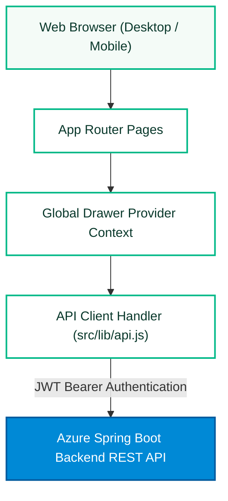

# Eventra Frontend

[](https://nextjs.org/)
[-00b887?style=for-the-badge)](#design-system--theme)
[](https://eventra-backend-springboot-eybhdvaubxcua7ha.centralindia-01.azurewebsites.net/swagger-ui/index.html)

Eventra Frontend is the Next.js 16 user interface for the Eventra Platform.

---

## Architecture & Visual Flows


```mermaid
graph TD
    classDef client fill:#f4fbf7,stroke:#00b887,stroke-width:2px,color:#09382b;
    classDef frontend fill:#ffffff,stroke:#00b887,stroke-width:2px,color:#09382b;
    classDef azure fill:#0089D6,stroke:#005a9e,stroke-width:2px,color:#ffffff;

    UserBrowser["Web Browser (Desktop / Mobile)"]:::client --> Router["App Router Pages"]:::frontend
    Router --> DrawerCtx["Global Drawer Provider Context"]:::frontend
    DrawerCtx --> APIClient["API Client Handler (src/lib/api.js)"]:::frontend
    APIClient -->|JWT Bearer Authentication| SpringBootAPI["Azure Spring Boot Backend REST API"]:::azure
```

---

## Running Locally

```bash
npm install
npm run dev
```

Open [http://localhost:3000](http://localhost:3000) in your browser.
