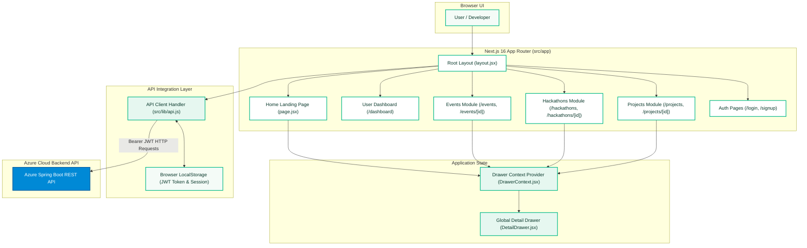
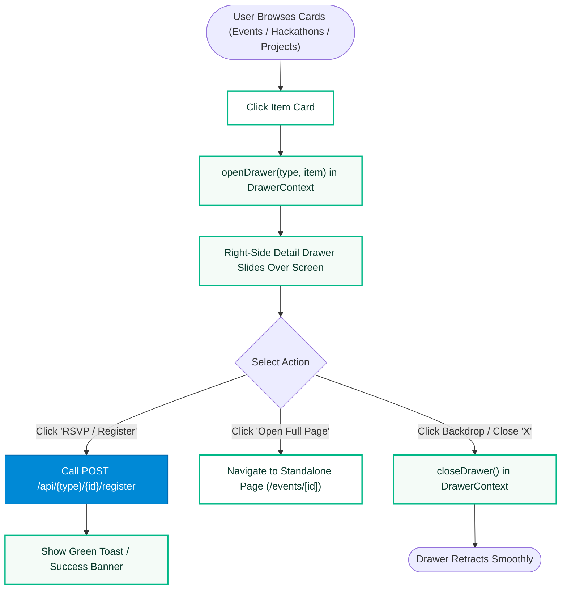
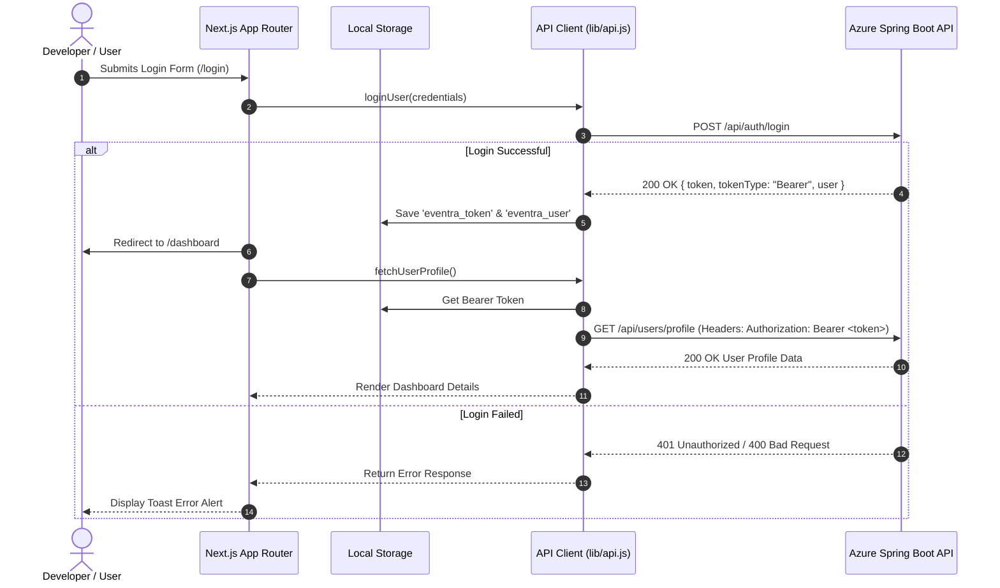

# Eventra - Next.js 16 Frontend Application

[](https://nextjs.org/)
[](https://spring.io/projects/spring-boot)
[](https://react.dev/)
[](https://tailwindcss.com/)
[-00b887?style=for-the-badge)](#design-system--theme)
[](https://eventra-backend-springboot-eybhdvaubxcua7ha.centralindia-01.azurewebsites.net/swagger-ui/index.html)

**Eventra** is the Next.js 16 web application interface for the Eventra Platform, seamlessly connected with a Spring Boot 3 REST API backend deployed on Azure Cloud. Built for developers, technical communities, and university chapters to discover tech workshops, join global hackathons, and showcase open-source projects.

---

## Key Features

- **Forest Mint Design System (`#f4fbf7` / `#00b887`)**: Custom aesthetic with dark headers, glassmorphism overlays, subtle micro-animations, and dynamic layout cards.
- **Global Slide-Over Detail Drawer**: Interactive right-side drawer component powered by React Context (`DrawerContext.jsx`), rendering quick action buttons, detailed agendas, and judging criteria.
- **Standalone & Drawer Duality**: Seamless transition between slide-over modal previews and full dedicated pages (`/events/[id]`, `/hackathons/[id]`, `/projects/[id]`).
- **Live Single-Card Step Carousel**: Auto-rotating hero carousel featuring active hackathons and featured community events.
- **JWT Session Persistence**: Client-side state synchronization with secure localStorage JWT storage (`eventra_token`) and automated user authentication headers.
- **Personalized User Dashboard (`/dashboard`)**: Full user profile summary, registered events management, upvoted projects tracker, and dynamic profile editing.

---

## Architecture & Visual Diagrams

### 1. Frontend System Architecture


```mermaid
graph TD
    classDef client fill:#f4fbf7,stroke:#00b887,stroke-width:2px,color:#09382b;
    classDef page fill:#ffffff,stroke:#00b887,stroke-width:2px,color:#09382b;
    classDef context fill:#e6f7f0,stroke:#00b887,stroke-width:2px,color:#09382b;
    classDef backend fill:#0089D6,stroke:#005a9e,stroke-width:2px,color:#ffffff;

    subgraph ClientBrowser ["Browser UI"]
        User["User / Developer"]:::client
    end

    subgraph NextJSApp ["Next.js 16 App Router (src/app)"]
        RootLayout["Root Layout (layout.jsx)"]:::page
        LandingPage["Home Landing Page (page.jsx)"]:::page
        Dashboard["User Dashboard (/dashboard)"]:::page
        EventsModule["Events Module (/events, /events/[id])"]:::page
        HackathonsModule["Hackathons Module (/hackathons, /hackathons/[id])"]:::page
        ProjectsModule["Projects Module (/projects, /projects/[id])"]:::page
        AuthModule["Auth Pages (/login, /signup)"]:::page
    end

    subgraph StateManagement ["Application State"]
        DrawerProvider["Drawer Context Provider (DrawerContext.jsx)"]:::context
        SlideOverDrawer["Global Detail Drawer (DetailDrawer.jsx)"]:::context
    end

    subgraph DataLayer ["API Integration Layer"]
        APIClient["API Client Handler (src/lib/api.js)"]:::context
        LocalStorage["Browser LocalStorage (JWT Token & Session)"]:::client
    end

    subgraph RemoteBackend ["Azure Cloud Backend API"]
        AzureSpring["Azure Spring Boot REST API"]:::backend
    end

    User --> RootLayout
    RootLayout --> LandingPage
    RootLayout --> Dashboard
    RootLayout --> EventsModule
    RootLayout --> HackathonsModule
    RootLayout --> ProjectsModule
    RootLayout --> AuthModule

    LandingPage --> DrawerProvider
    EventsModule --> DrawerProvider
    HackathonsModule --> DrawerProvider
    ProjectsModule --> DrawerProvider
    
    DrawerProvider --> SlideOverDrawer
    RootLayout --> APIClient
    APIClient <--> LocalStorage
    APIClient -->|Bearer JWT HTTP Requests| AzureSpring
```

---

### 2. Slide-Over Detail Drawer & Navigation Workflow


```mermaid
flowchart TD
    classDef action fill:#ffffff,stroke:#00b887,stroke-width:2px,color:#09382b;
    classDef drawer fill:#f4fbf7,stroke:#00b887,stroke-width:2px,color:#09382b;
    classDef api fill:#0089D6,stroke:#005a9e,color:#ffffff;

    Start(["User Browses Cards (Events / Hackathons / Projects)"]) --> ClickCard["Click Item Card"]:::action
    ClickCard --> OpenDrawer["openDrawer(type, item) in DrawerContext"]:::drawer
    OpenDrawer --> SlideIn["Right-Side Detail Drawer Slides Over Screen"]:::drawer

    SlideIn --> UserAction{Select Action}
    
    UserAction -->|Click 'RSVP / Register'| PerformAPI["Call POST /api/{type}/{id}/register"]:::api
    PerformAPI --> UpdateUI["Show Green Toast / Success Banner"]:::drawer
    
    UserAction -->|Click 'Open Full Page'| FullPage["Navigate to Standalone Page (/events/[id])"]:::action
    
    UserAction -->|Click Backdrop / Close 'X'| CloseDrawer["closeDrawer() in DrawerContext"]:::drawer
    CloseDrawer --> End(["Drawer Retracts Smoothly"])
```

---

### 3. Authentication & Protected API Requests Sequence


```mermaid
sequenceDiagram
    autonumber
    actor User as Developer / User
    participant App as Next.js App Router
    participant Store as Local Storage
    participant API as API Client (lib/api.js)
    participant Azure as Azure Spring Boot API

    User->>App: Submits Login Form (/login)
    App->>API: loginUser(credentials)
    API->>Azure: POST /api/auth/login
    
    alt Login Successful
        Azure-->>API: 200 OK { token, tokenType: "Bearer", user }
        API->>Store: Save 'eventra_token' & 'eventra_user'
        App->>User: Redirect to /dashboard
        
        App->>API: fetchUserProfile()
        API->>Store: Get Bearer Token
        API->>Azure: GET /api/users/profile (Headers: Authorization: Bearer <token>)
        Azure-->>API: 200 OK User Profile Data
        API-->>App: Render Dashboard Details
    else Login Failed
        Azure-->>API: 401 Unauthorized / 400 Bad Request
        API-->>App: Return Error Response
        App-->>User: Display Toast Error Alert
    end
```

---

## Technology Stack

| Category | Technology | Description |
| :--- | :--- | :--- |
| **Framework** | Next.js 16 | React framework utilizing App Router & Turbopack |
| **UI Core** | React 19 & React DOM 19 | Standardized functional components & hooks |
| **Styling** | Tailwind CSS 4 & PostCSS | Modern utility-first CSS styling engine |
| **Icons** | Lucide React | Clean, responsive vector icon library |
| **State Management**| React Context | Global drawer state and overlay management |
| **API Client** | Native Fetch API (`src/lib/api.js`) | Centralized HTTP wrapper with automatic JWT injection |
| **Backend Endpoint**| Azure Spring Boot 3 | Hosted cloud REST API service |

---

## Directory Structure

```
Eventra/
├── src/
│   ├── app/
│   │   ├── dashboard/         # User profile, registered events & activity dashboard
│   │   ├── events/            # Technical workshops & event listings (+ [id] details)
│   │   ├── hackathons/        # Global hackathons listing (+ [id] details)
│   │   ├── projects/          # Open-source projects showcase (+ [id] details)
│   │   ├── login/             # Login authentication page
│   │   ├── signup/            # Account registration page
│   │   ├── globals.css        # Global CSS styles, Tailwind imports & animations
│   │   ├── layout.jsx         # App shell with Nav, Footer, and DrawerProvider
│   │   └── page.jsx           # Platform landing page with hero carousel
│   ├── components/
│   │   ├── home/              # Carousel, Featured Events, Hero & Workflow
│   │   └── ui/                # DetailDrawer, EventCard, HackathonCard, ProjectCard
│   ├── context/
│   │   └── DrawerContext.jsx  # Context management for slide-over drawer drawer state
│   └── lib/
│       └── api.js             # Live API service connector (Azure Spring Boot API)
├── public/                    # Static images, icons, and assets
├── jsconfig.json              # Module alias mapping (@/* -> ./src/*)
├── next.config.ts             # Next.js configuration settings
├── package.json               # NPM scripts and project dependencies
└── README.md                  # Frontend documentation
```

---

## Local Development Setup

### Prerequisites

- **Node.js**: `v18.0.0` or higher
- **npm**: `v9.0.0` or higher

### Step-by-Step Setup

1. **Navigate to the frontend directory**:
   ```bash
   cd Eventra
   ```

2. **Install dependencies**:
   ```bash
   npm install
   ```

3. **Run the development server**:
   ```bash
   npm run dev
   ```

4. **Access the application**:
   Open [http://localhost:3000](http://localhost:3000) in your web browser.

5. **Build & Test Production Release**:
   ```bash
   npm run build
   npm run start
   ```

---

## Live API Integration

- **Backend Base URL**: `https://eventra-backend-springboot-eybhdvaubxcua7ha.centralindia-01.azurewebsites.net`
- **Interactive OpenAPI Specification**: [Swagger UI Documentation](https://eventra-backend-springboot-eybhdvaubxcua7ha.centralindia-01.azurewebsites.net/swagger-ui/index.html)

---

## License

This project is open-source under the [MIT License](LICENSE).
