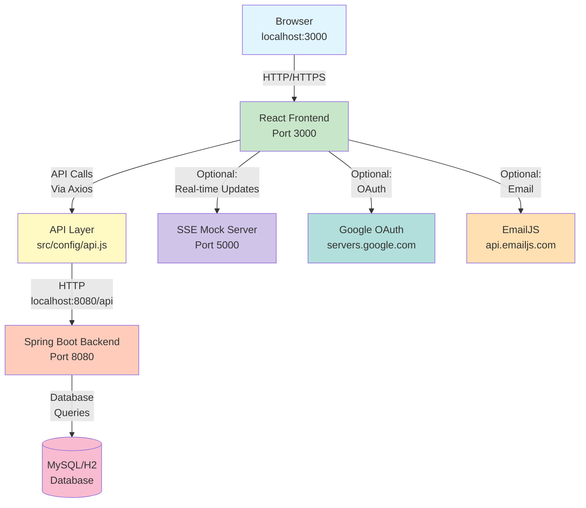
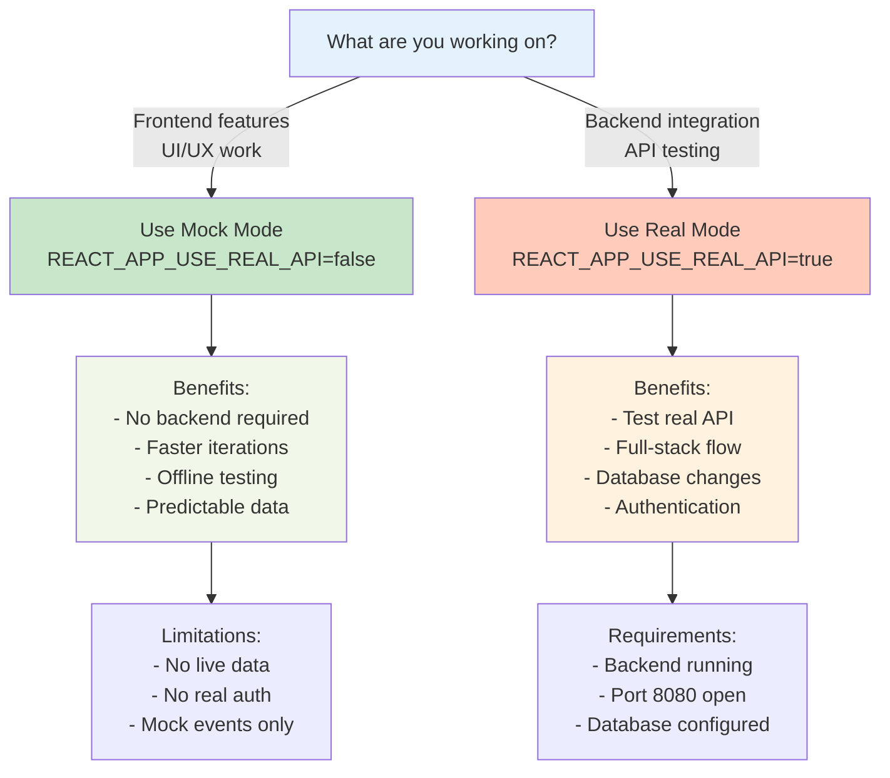

# Eventra Environment Setup Guide

A comprehensive guide to configuring the Eventra event management platform for local development, testing, and deployment.

---

## Introduction

Eventra is a **distributed event management platform** with a clear separation between frontend and backend services. Proper environment configuration is critical because:

- **Frontend (React 19)** and **Backend (Spring Boot)** communicate over HTTP APIs
- **Optional integrations** (Google OAuth, EmailJS, SSE) enhance features but aren't strictly required
- **Mock vs Real API modes** allow flexible development workflows
- **Security depends on** proper secret management and deployment-specific configuration

This guide helps you:
- Set up the project locally for development
- Understand required vs optional environment variables
- Debug common configuration issues
- Avoid security and deployment mistakes

---

## Local Development Architecture

Eventra uses a **client-server architecture** with clear communication boundaries. Here's how it works:

### System Flow Diagram



### Key Points

| Component | Default URL | Purpose |
|-----------|------------|---------|
| **React Frontend** | `http://localhost:3000` | Serves UI, handles routing, manages state |
| **Spring Boot Backend** | `http://localhost:8080/api` | REST API endpoints, business logic, database |
| **SSE Mock Server** | `http://localhost:5000` | Real-time event notifications (optional) |
| **External APIs** | Various | Google OAuth, EmailJS, GitHub API (optional) |

### How Requests Flow

1. **User interacts** with React UI (localhost:3000)
2. **React component** makes API call via Axios (`src/config/api.js`)
3. **API layer** prepends base URL from `REACT_APP_API_URL`
4. **Request sent** to Spring Boot backend (`localhost:8080/api/...`)
5. **Backend processes** request, queries database, returns JSON
6. **React updates** UI with response data

### Vercel Deployment Note

In production (Vercel), the `vercel.json` rewrites `/api/*` requests to the Azure-hosted backend:
```
/api/events -> https://eventra-backend-springboot-*.azurewebsites.net/api/events
```

This allows frontend and backend to deploy independently.

---

## Environment File Setup

### Where to Place `.env` Files

Environment variables in Eventra are configured through `.env` files in the project root:

```
Eventra/
+-- .env              <- Local development (gitignored)
+-- .env.local        <- Optional local overrides (gitignored)
+-- .env.example      <- Template with placeholder values (committed)
+-- .env.production   <- Production variables (Vercel-managed)
+-- package.json
+-- src/
```

### Creating Your `.env` File

1. **Copy the template:**
   ```bash
   cp .env.example .env
   ```

2. **Fill in your values** (see [Environment Variables Reference](#environment-variables-reference))

3. **Restart dev server** for changes to take effect:
   ```bash
   npm start
   ```

### File Priority (Highest to Lowest)

```
.env.local              <- Override everything (local-only)
    v
.env.development        <- Development mode specifics
    v
.env                    <- General configuration
    v
.env.example            <- Fallback defaults
```

### Important Notes

- Warning: **Never commit secrets** to `.env` (it's gitignored)
- **Keep `.env.example` updated** when adding new variables
- **Dev server must restart** when `.env` changes
- **REACT_APP prefix is required** for variables accessible in browser

### Example `.env` File

```env
# ============================================
# API Configuration (REQUIRED)
# ============================================
REACT_APP_API_URL=http://localhost:8080/api
REACT_APP_USE_REAL_API=true

# ============================================
# Optional: Google OAuth (for sign-in)
# ============================================
REACT_APP_GOOGLE_CLIENT_ID=YOUR_CLIENT_ID_HERE

# ============================================
# Optional: EmailJS (for contact form)
# ============================================
REACT_APP_EMAILJS_SERVICE_ID=service_xxxxx
REACT_APP_EMAILJS_TEMPLATE_ID=template_xxxxx
REACT_APP_EMAILJS_PUBLIC_KEY=public_key_xxxxx

# ============================================
# Optional: GitHub Integration (for proxy)
# ============================================
GITHUB_TOKEN=ghp_xxxxxxxxxxxxxxxxxxxxx

# ============================================
# Optional: SSE Real-time Features
# ============================================
REACT_APP_SSE_URL=http://localhost:4001
```

---

## Environment Variables Reference

### Complete Variable Documentation

| Variable Name | Required | Purpose | Example Value | Safe for Client* | Notes |
|---------------|----------|---------|----------------|------------------|-------|
| **REACT_APP_API_URL** | ✅ Yes | Backend API endpoint | `http://localhost:8080/api` | ✅ Yes | Exposed in build; configure per environment |
| **REACT_APP_USE_REAL_API** | ❌ Optional | Use real backend vs mock data | `true` or `false` | ✅ Yes | Useful for testing without backend |
| **REACT_APP_GOOGLE_CLIENT_ID** | ❌ Optional | Google OAuth authentication | `123456789.apps.googleusercontent.com` | ✅ Yes | Public ID; enables Google Sign-In |
| **REACT_APP_EMAILJS_SERVICE_ID** | ❌ Optional | EmailJS service identifier | `service_abc123xyz` | ✅ Yes | Enables contact form emails |
| **REACT_APP_EMAILJS_TEMPLATE_ID** | ❌ Optional | EmailJS email template | `template_abc123xyz` | ✅ Yes | Paired with SERVICE_ID |
| **REACT_APP_EMAILJS_PUBLIC_KEY** | ❌ Optional | EmailJS public API key | `AbCdEfGhIjKlMnOpQrS` | ✅ Yes | Public key for client-side requests |
| **REACT_APP_SSE_URL** | ❌ Optional | Server-Sent Events endpoint | `http://localhost:4001` | ✅ Yes | Enables real-time notifications |
| **GITHUB_TOKEN** | ❌ Optional | GitHub API authentication | `ghp_xxxxxxxxxxxxxxxxxxxx` | ❌ **No** | Keep private! Use Vercel secrets |
| **REACT_APP_MOCK_EVENTS** | ❌ Optional | Enable mock event data | `true` or `false` | ✅ Yes | Fallback when API unavailable |

*"Safe for Client?" = Can be safely included in frontend bundle. Browser console will expose it.

---

## Feature Mapping for Optional Integrations

Understanding what happens when optional integrations are missing helps prevent surprise bugs.

### Feature Enable/Disable Matrix

| Feature | Required Variables | Status When Missing | Behavior |
|---------|-------------------|-------------------|----------|
| **Google OAuth Sign-In** | `REACT_APP_GOOGLE_CLIENT_ID` | 🔴 Disabled | Google button hidden or shows error; email/password login still works |
| **Contact Form Emails** | All `REACT_APP_EMAILJS_*` (3 vars) | 🟡 Warning | Contact form shows; submission attempted but may fail silently or log error |
| **Real-time Notifications** | `REACT_APP_SSE_URL` | 🟡 Degraded | Page still loads; live updates won't work; user sees stale data until refresh |
| **GitHub Integration** | `GITHUB_TOKEN` | 🟡 Limited | GitHub profile links work; direct API calls may fail (rate limited) |
| **Event Analytics** | Backend running | 🔴 Disabled | Analytics dashboard still renders but shows no data |
| **Email Notifications** | Backend + EmailJS | 🟡 Partial | Users won't receive email; but can still see in-app notifications |

### What This Means for Development

```javascript
// Example: Google OAuth Button Component
// If REACT_APP_GOOGLE_CLIENT_ID is missing:
if (!process.env.REACT_APP_GOOGLE_CLIENT_ID) {
  return null; // Button hidden
}
```

---

## Real API vs Mock API Mode

Eventra supports two development workflows depending on your needs:

### Mode Decision Flowchart



### Configuration Comparison

```markdown
+--------------------------------------------------------------+
|                    MOCK MODE (Recommended for UI Work)       |
+--------------------------------------------------------------+
| REACT_APP_USE_REAL_API=false                                 |
| REACT_APP_API_URL=http://localhost:3000/api                  |
|                                                              |
| Frontend renders with hardcoded mock data                 |
| No network requests to backend                            |
| Faster page loads                                         |
| Works without Spring Boot running                         |
| Perfect for GitHub Actions CI/CD                          |
|                                                              |
| npm start -> http://localhost:3000 (mock data)                |
+--------------------------------------------------------------+
```

```markdown
+--------------------------------------------------------------+
|                  REAL MODE (Full-Stack Testing)              |
+--------------------------------------------------------------+
| REACT_APP_USE_REAL_API=true                                  |
| REACT_APP_API_URL=http://localhost:8080/api                  |
|                                                              |
| Communicates with actual Spring Boot backend              |
| Real database operations                                  |
| Tests authentication flow                                 |
| Validates API contracts                                   |
| Warning: Backend must be running on port 8080                     |
| Warning: Slower development cycle                                 |
|                                                              |
| npm start -> localhost:3000                                   |
| java -jar backend.jar -> localhost:8080 (separate terminal)   |
+--------------------------------------------------------------+
```

### API Layer Detection

The API configuration in `src/config/api.js` automatically detects your mode:

```javascript
// Simplified view of how Eventra routes API calls:

if (REACT_APP_USE_REAL_API === 'false') {
  // Mock mode: return hardcoded data from /api/mock-data
  return mockEventsList;
} else {
  // Real mode: make actual HTTP request
  return axios.get(`${REACT_APP_API_URL}/events`);
}
```

### When to Use Which Mode

| Scenario | Mode | Why |
|----------|------|-----|
| Building UI components | **Mock** | No backend dependency, fastest iteration |
| Styling and animations | **Mock** | UI work doesn't need real data |
| Testing API integration | **Real** | Must validate backend communication |
| Full-stack feature (auth + UI) | **Real** | Need authentication flow |
| GitHub Actions CI/CD | **Mock** | Backend not available in CI |
| Offline development | **Mock** | No network needed |
| Pre-deployment testing | **Real** | Verify production setup |

---

## Running the Project Locally

### Prerequisites

Before starting, ensure you have:

```bash
# Check Node.js version (v16.x or higher)
node --version
# Output: v18.x.x or higher

# Check npm
npm --version
# Output: v9.x.x or higher

# Verify Git
git --version
# Output: git version 2.x.x
```

### Frontend Setup (React)

**Step 1: Clone and Install**
```bash
# Clone the repository
git clone https://github.com/SandeepVashishtha/Eventra.git
cd Eventra

# Install dependencies
npm install
```

**Step 2: Configure Environment**
```bash
# Copy the template
cp .env.example .env

# Edit .env with your values (see reference above)
# Minimum required:
#   REACT_APP_API_URL=http://localhost:8080/api
#   REACT_APP_USE_REAL_API=true
```

**Step 3: Start Development Server**
```bash
# Option A: Standard dev server (with ESLint)
npm start

# Option B: Faster dev server (ESLint disabled)
npm run dev

# Output: Compiled successfully!
#         Local: http://localhost:3000
```

**Step 4: Verify in Browser**
- Open http://localhost:3000
- You should see the Eventra home page
- Check browser console (`F12`) for any errors

### Backend Setup (Spring Boot)

> **Note:** If using **Mock Mode** (`REACT_APP_USE_REAL_API=false`), you can skip backend setup.

**Prerequisites:**
- Java 11 or higher installed
- Maven or Gradle available

**Step 1: Clone Backend Repository**
```bash
# In a separate directory
git clone https://github.com/SandeepVashishtha/Eventra-Backend.git
cd Eventra-Backend
```

**Step 2: Configure Database**
```bash
# Create database (MySQL example)
# Or H2 for in-memory testing
# See backend README for specifics
```

**Step 3: Build and Run**
```bash
# Using Maven
mvn clean install
mvn spring-boot:run

# Using Gradle
gradle build
gradle bootRun

# Expected output:
# Tomcat started on port(s): 8080 (http)
# Started EventraBackendApplication in X.XXX seconds
```

**Step 4: Verify Backend Health**
```bash
# Check if backend is running
curl http://localhost:8080/api/health

# Expected response:
# {"status": "UP"}

# Or visit Swagger UI
# http://localhost:8080/swagger-ui/index.html
```

### Recommended Startup Order

**For Full-Stack Development:**

```
Terminal 1:                    Terminal 2:
+- cd Eventra                  +- cd Eventra-Backend
+- npm install                 +- mvn clean install
+- npm start                   +- mvn spring-boot:run
+- http://localhost:3000       +- http://localhost:8080
```

**For Frontend-Only Development:**

```
Terminal 1:
+- cd Eventra
+- npm install
+- REACT_APP_USE_REAL_API=false npm start
+- http://localhost:3000
```

### Health Check URLs

After startup, verify everything is running:

| Service | URL | Expected Response |
|---------|-----|-------------------|
| **Frontend** | http://localhost:3000 | Eventra UI loads |
| **Backend API** | http://localhost:8080/api/health | `{"status":"UP"}` |
| **API Documentation** | http://localhost:8080/swagger-ui/index.html | Swagger UI |
| **React DevTools** | Browser console | No major errors |

---

## Troubleshooting & Common Issues

### CORS Errors

**Symptom:**
```
Access to XMLHttpRequest at 'http://localhost:8080/api/events' from origin 'http://localhost:3000' 
has been blocked by CORS policy: No 'Access-Control-Allow-Origin' header is present on the requested resource.
```

**Root Cause:**
- Browser blocks cross-origin requests (different ports = different origins)
- Backend not configured to accept frontend requests

**Solution:**

1. **Verify Backend CORS Config:**
   - Check Spring Boot backend `application.yml` or `@CrossOrigin` annotations
   - Ensure `localhost:3000` is whitelisted

   ```java
   // Backend example (Spring Boot)
   @CrossOrigin(origins = "http://localhost:3000")
   @RestController
   public class EventController { ... }
   ```

2. **Verify Frontend API URL:**
   ```bash
   # .env should have:
   REACT_APP_API_URL=http://localhost:8080/api
   REACT_APP_USE_REAL_API=true
   ```

3. **Restart Both Servers:**
   ```bash
   # Terminal 1: Ctrl+C, then
   npm start

   # Terminal 2: Ctrl+C, then
   mvn spring-boot:run
   ```

4. **Check Browser Console:**
   ```
   F12 -> Console -> Look for blue CORS error
   F12 -> Network -> Check Request Headers for Origin
   ```

---

### Port Conflicts

**Symptom:**
```
Error: listen EADDRINUSE: address already in use :::3000
```

**Solution:**

```bash
# Find process using port 3000
lsof -i :3000                    # macOS/Linux
netstat -ano | findstr :3000     # Windows

# Kill the process
kill -9 PID                       # macOS/Linux
taskkill /PID PORT /F             # Windows

# Or use a different port
PORT=3001 npm start
```

**Port Reference:**
| Port | Service | Required |
|------|---------|----------|
| **3000** | React Frontend | Yes (or configure different) |
| **8080** | Spring Boot Backend | Yes (if using real API) |
| **5000** | SSE Mock Server | Optional |

---

### Google OAuth Issues

**Symptom:**
```
Google Sign-In popup blocked or not working
```

**Causes & Solutions:**

1. **Missing Client ID:**
   ```bash
   # .env is missing or has wrong value
   REACT_APP_GOOGLE_CLIENT_ID=                # Empty
   REACT_APP_GOOGLE_CLIENT_ID=123456789...    # Correct
   ```
   - Solution: Get Client ID from Google Cloud Console

2. **Redirect URI Mismatch:**
   - Google console must have: `http://localhost:3000`
   - If not listed, add it and wait 5 minutes for changes

3. **Popup Blocked:**
   ```javascript
   // Browser may block popup for security
   // Solution: Click "Sign in with Google" button directly
   // (not through redirect link)
   ```

4. **Dev Server Restart Required:**
   ```bash
   npm start  # CTRL+C and restart after .env changes
   ```

---

### Environment Variable Not Loading

**Symptom:**
```javascript
console.log(process.env.REACT_APP_API_URL);  // undefined
```

**Causes & Solutions:**

| Issue | Check | Solution |
|-------|-------|----------|
| Variable not in `.env` | File exists: `ls -la .env` | Add variable to `.env` |
| Wrong variable name | Use `REACT_APP_` prefix | Rename to `REACT_APP_MYVAR` |
| Dev server not restarted | Terminal running? | `npm start` -> Ctrl+C -> `npm start` |
| `.env` file in wrong location | Check `pwd` in terminal | `.env` must be in root `/Eventra` |
| Syntax error in `.env` | No spaces around `=` | Change `A = B` to `A=B` |
| Comment syntax wrong | Only `#` comments valid | Change `REACT_APP_A=value # comment` to two lines |

**Verification:**
```bash
# After restart, check if variable loaded
npm start

# In browser console:
console.log(process.env.REACT_APP_API_URL);  // Should print value
```

---

### API Request Failures (404, 401, 500)

**Symptom:**
```
GET http://localhost:8080/api/events -> 404 Not Found
GET http://localhost:8080/api/auth/login -> 401 Unauthorized
```

**Debugging Steps:**

```bash
# Step 1: Verify backend is running
curl http://localhost:8080/api/health
# Expected: {"status":"UP"}

# Step 2: Check correct endpoint exists
curl http://localhost:8080/swagger-ui/index.html
# Look for endpoint in Swagger documentation

# Step 3: Verify API URL in .env
cat .env | grep REACT_APP_API_URL
# Should show: REACT_APP_API_URL=http://localhost:8080/api

# Step 4: Check browser network tab
# F12 -> Network -> Look for failed requests
# -> Click request -> Response tab for error details
```

**Common Status Codes:**

| Code | Meaning | Solution |
|------|---------|----------|
| **404** | Endpoint not found | Check spelling, backend running? |
| **401** | Not authenticated | Missing/expired JWT token |
| **403** | Forbidden | User lacks permission for action |
| **500** | Server error | Check backend logs for details |
| **502** | Bad gateway | Backend not running or not reachable |

---

### Real-time Features Not Working

**Symptom:**
```
Real-time notifications not updating
EventSource connection failed
```

**Solution:**

1. **SSE Server Not Running:**
   ```bash
   # Check if SSE server is running
   curl http://localhost:5000
   
   # If not, start it
   node sse-mock-server.js
   ```

2. **SSE URL Misconfigured:**
   ```bash
   # .env should have:
   REACT_APP_SSE_URL=http://localhost:4001
   ```

3. **Browser Not Supporting SSE:**
   - SSE works in all modern browsers except older IE
   - Check: F12 -> Network -> Look for EventSource connection

---

### Offline or Network Issues

**Symptom:**
```
Network unavailable, but app should work offline
```

**Solution:**

1. **Check Offline Queue:**
   - Eventra caches requests when offline
   - When online again, queue is processed
   - **Status indicator** in navbar shows connection state

2. **Enable Mock Mode:**
   ```bash
   # Use mock data instead of API
   REACT_APP_USE_REAL_API=false npm start
   ```

3. **Check Service Worker:**
   ```javascript
   // Browser console:
   navigator.serviceWorker.getRegistrations()
     .then(regs => console.log(regs));
   ```

---

## Deployment & Security Guidelines

### Warning CRITICAL: Frontend Environment Variables Are Public

**Remember:** Variables prefixed with `REACT_APP_` are embedded in your production build and **visible to anyone**.

```javascript
// This is visible in the browser:
console.log(process.env.REACT_APP_API_URL);  // Fine to expose
console.log(process.env.REACT_APP_GOOGLE_CLIENT_ID);  // Fine (it's a public ID)

// This will NOT be included (good!):
console.log(process.env.DATABASE_PASSWORD);  // Cannot access (no REACT_APP_ prefix)
```

### Safe vs Unsafe Variables

| Variable | Safe to Expose? | Why | Storage |
|----------|-----------------|-----|---------|
| `REACT_APP_API_URL` | Yes | It's a public endpoint | Frontend bundle |
| `REACT_APP_GOOGLE_CLIENT_ID` | Yes | Google OAuth requires public ID | Frontend bundle |
| `REACT_APP_EMAILJS_PUBLIC_KEY` | Yes | EmailJS public key; name says "public" | Frontend bundle |
| `GITHUB_TOKEN` | **No** | Private authentication token | Backend only / Vercel secrets |
| `DATABASE_PASSWORD` | **No** | Database credentials must be private | Backend .env (not in repo) |
| `JWT_SECRET` | **No** | Secret for signing tokens | Backend only |
| `EMAILJS_PRIVATE_KEY` | **No** | Private key (different from public) | Backend only |

### Deployment Secrets Checklist

Before deploying to production:

- [ ] **Never commit `.env` to Git**
  ```bash
  # .gitignore should have:
  .env
  .env.local
  .env.*.local
  ```

- [ ] **Use Vercel Secrets Dashboard for production**
  - Navigate to: Settings -> Environment Variables
  - Add `REACT_APP_API_URL` -> production backend URL
  - Add `REACT_APP_GOOGLE_CLIENT_ID` -> production client ID
  - Warning: Never paste `GITHUB_TOKEN` into Vercel UI (if used at build time)

- [ ] **Keep `.env.example` without secrets**
  ```bash
  # .env.example (safe to commit)
  REACT_APP_API_URL=http://localhost:8080/api
  REACT_APP_GOOGLE_CLIENT_ID=your_client_id_here
  GITHUB_TOKEN=                                    # Empty placeholder
  ```

- [ ] **Rotate tokens after deployment**
  - Regenerate Google Client IDs monthly
  - Regenerate GitHub tokens quarterly
  - Monitor unused API keys and remove them

### Vercel Deployment Configuration

See `vercel.json` for API rewrites:

```json
{
  "rewrites": [
    {
      "source": "/api/:path*",
      "destination": "https://eventra-backend-springboot-*.azurewebsites.net/api/:path*"
    }
  ]
}
```

This means:
- Browser request: `https://eventra.com/api/events`
- Server rewrites to: `https://[backend-url]/api/events`
- User never sees backend URL (good for security!)

---

## Recommended Developer Workflow

### Best Practices for Configuration Management

```markdown
+-----------------------------------------------------------------+
|                    DEVELOPMENT WORKFLOW                         |
+-----------------------------------------------------------------+
|                                                                 |
| 1  BEFORE STARTING                                            |
|    +- cp .env.example .env                                     |
|    +- Edit .env with your local values                         |
|    +- Never commit .env (it's in .gitignore)                   |
|                                                                 |
| 2  WHEN ADDING NEW VARIABLES                                  |
|    +- Add to .env (local development)                          |
|    +- Add to .env.example (shared template)                    |
|    +- Commit only .env.example to Git                          |
|    +- Document in docs/ENV_SETUP_GUIDE.md (this file)          |
|                                                                 |
| 3  WHEN CHANGING ENVIRONMENT                                  |
|    +- Update .env for your environment                         |
|    +- Restart dev server: npm start                            |
|    +- Clear browser cache if needed: Ctrl+Shift+Del            |
|                                                                 |
| 4  BEFORE PUSHING CODE                                        |
|    +- Verify .env is in .gitignore: git check-ignore .env      |
|    +- Confirm secrets not in recent commits: git log -p        |
|    +- Update .env.example with new variables                   |
|                                                                 |
| 5  BEFORE DEPLOYING TO PRODUCTION                             |
|    +- Add variables to Vercel dashboard (not in code)          |
|    +- Double-check REACT_APP_API_URL points to prod backend    |
|    +- Remove debug/mock variables before build                 |
|    +- Test production build locally: npm run build             |
|                                                                 |
+-----------------------------------------------------------------+
```

### Environment-Specific Configurations

**Local Development:**
```bash
REACT_APP_API_URL=http://localhost:8080/api
REACT_APP_USE_REAL_API=true
REACT_APP_DEBUG=true  # Enable debug logs
```

**Staging (Internal Testing):**
```bash
REACT_APP_API_URL=https://staging-backend.example.com/api
REACT_APP_USE_REAL_API=true
REACT_APP_DEBUG=true  # Keep debug logs for troubleshooting
```

**Production:**
```bash
REACT_APP_API_URL=https://eventra-backend-springboot-*.azurewebsites.net/api
REACT_APP_USE_REAL_API=true
REACT_APP_DEBUG=false  # Disable debug logs in production
```

---

## Contributor Notes

### Key Files for Environment & Configuration

When working with environment setup, these files are critical:

| File | Purpose | What to Know |
|------|---------|--------------|
| `src/config/api.js` | **API base configuration** | Entry point for all API calls; reads `REACT_APP_API_URL` |
| `src/context/AuthContext.js` | **Authentication provider** | Reads JWT tokens; integrates with API configuration |
| `vercel.json` | **Production rewrites** | Defines how `/api/*` routes are proxied to backend |
| `.env.example` | **Configuration template** | Reference for all available variables |
| `.gitignore` | **Git exclusions** | Ensures `.env` is never committed (security critical) |

### How the API Layer Works

```javascript
// Simplified view of src/config/api.js

import axios from 'axios';

// 1. Read environment variable
const API_BASE_URL = process.env.REACT_APP_API_URL;
// -> http://localhost:8080/api (local dev)
// -> https://eventra-backend-*.azurewebsites.net/api (production)

// 2. Create Axios instance with base URL
const api = axios.create({
  baseURL: API_BASE_URL,
  withCredentials: true,  // Include cookies (for HttpOnly JWT)
});

// 3. Use in components
const response = await api.get('/events');
// -> Actual request: GET http://localhost:8080/api/events
```

### Testing Your Configuration

```javascript
// Add this to browser console to verify setup:

console.log({
  apiUrl: process.env.REACT_APP_API_URL,
  useRealApi: process.env.REACT_APP_USE_REAL_API,
  googleClientId: process.env.REACT_APP_GOOGLE_CLIENT_ID ? 'Loaded' : 'Missing',
});

// Output example:
// {
//   apiUrl: "http://localhost:8080/api",
//   useRealApi: "true",
//   googleClientId: "Loaded"
// }
```

---

## Future Improvements

Potential enhancements to environment setup:

- [ ] **Docker Compose** for one-command full-stack startup
- [ ] **Environment Validation Script** to catch misconfigurations early
- [ ] **TypeScript Environment Types** for safer environment variable access
- [ ] **Automated `.env` Generator** based on user input
- [ ] **Pre-commit Hooks** to prevent accidental secret commits
- [ ] **Environment-Specific Build Scripts** for different deployment targets
- [ ] **Health Check Dashboard** to visualize all service statuses
- [ ] **Integration Tests** that verify environment setup correctness

---

## Getting Help

### Common Resources

- **Backend Setup:** [Eventra-Backend README](https://github.com/SandeepVashishtha/Eventra-Backend)
- **Architecture Guide:** [docs/ARCHITECTURE_AND_ROLES.md](./ARCHITECTURE_AND_ROLES.md)
- **Issue Tracker:** [GitHub Issues](https://github.com/SandeepVashishtha/Eventra/issues)


### Reporting Issues

If you encounter setup problems:

1. **Check this guide** for known issues
2. **Search GitHub Issues** for similar problems
3. **Provide debugging info:**
   ```bash
   node --version
   npm --version
   cat .env  # Don't include secrets!
   npm start  # Show error output
   ```
4. **Open a GitHub Issue** with reproduction steps

---

**Last Updated:** May 2026  
**Eventra Version:** 1.0.0+  
**Maintainers:** [@SandeepVashishtha](https://github.com/SandeepVashishtha) & Contributors
