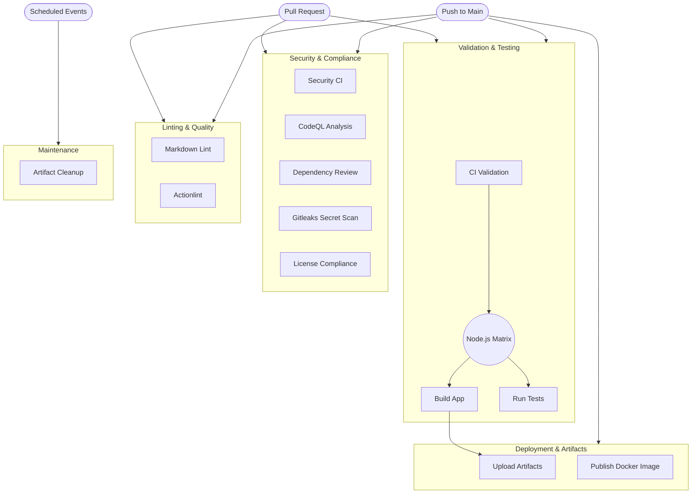

# CI/CD Workflow Architecture

This document describes the Continuous Integration and Continuous Deployment (CI/CD) architecture of the Eventra project, powered by GitHub Actions.

## Overview Diagram

The following Mermaid diagram illustrates the end-to-end CI/CD process:

## Workflows Explained

- **CI Validation (`ci.yml`)**: Compiles the source code, lints, and runs tests across a matrix of Node.js versions. Uses `.github/workflows/reusable-setup.yml` for execution.
- **Security Validation (`security-ci.yml`)**: Includes various security checks for the underlying Node.js environment.
- **CodeQL Analysis (`codeql.yml`)**: Runs GitHub's native static code analysis to discover deep vulnerabilities.
- **Gitleaks (`gitleaks.yml`)**: Secret scanning tool that prevents API keys or passwords from being merged.
- **License Compliance (`license-check.yml`)**: Prevents dependencies with overly restrictive copyleft licenses from being merged into the repository.
- **Dependency Review (`dependency-review.yml`)**: Assesses any pull request that changes package files for vulnerable dependencies.
- **Actionlint (`actionlint.yml`)**: Statically validates the `.yml` workflow files themselves.
- **Markdown Lint (`markdown-lint.yml`)**: Ensures consistent Markdown formatting across all documentation files.
- **Docker Publish (`docker-publish.yml`)**: Automatically builds and publishes Docker images to a registry upon merging into the default branch.
- **Artifact Cleanup (`artifact-cleanup.yml`)**: A scheduled job that deletes stale workflow artifacts to save GitHub Actions storage.
